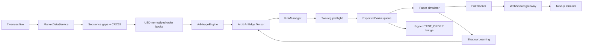

# ArbitrAI

<p align="center">
  <strong>Inteligencia de arbitraje BTC con calidad institucional, accesible para cualquier developer.</strong>
</p>

<p align="center">
  <a href="https://github.com/JoahanMorales">GitHub</a> ·
  <a href="https://www.linkedin.com/in/joahan-morales/">LinkedIn</a>
</p>

<p align="center">
  
  
  
  
  
</p>

ArbitrAI es un sistema de arbitraje BTC event-driven para `CODING_CHALLENGE_MEXICO`. Conecta feeds públicos reales, normaliza `order books`, detecta oportunidades, calcula rentabilidad neta con fricciones realistas y explica por qué una señal se ejecuta o se descarta.

La entrega pública separa con claridad:

- `Live market data`: precios reales recibidos por `WebSocket` o `REST fallback`.
- `Paper P&L`: fills simulados sobre datos reales o sobre el simulador.
- `Signed TEST_ORDER`: validación autenticada sin mover fondos.
- `Demo`: escenario controlado para mostrar el ciclo completo cuando el mercado está quieto.

## Demo web

| Ruta | Propósito |
|---|---|
| `/` | Landing simple con visualización del flujo AET. |
| `/terminal` | Trading terminal con datos en tiempo real. |
| `/inteligencia` | Explicación técnica animada del modelo. |
| `/resultados` | Benchmark reproducible y prueba separada de `TEST_ORDER`. |

## Diferenciadores

### 1. ArbitrAI Edge Tensor

AET estima si un edge visible sobrevivirá el tiempo suficiente para ejecutarse. Combina:

- `OFI` y `MLOFI` top-5;
- `microprice skew`;
- liquidez disponible e impacto;
- volatilidad reciente;
- `quote age` y `quote skew` entre venues;
- calibración por ruta usando `markouts`.

El resultado incluye `survival probability`, `fill probability`, `leg risk`, `adverse selection`, `Expected Value`, `suggested size` y un score explicable de `0-100`. La queue usa `Expected Value`, no el spread bruto.

### 2. Tres estrategias

| Estrategia | Criterio |
|---|---|
| `CROSS_EXCHANGE` | Compra el mejor `ask` y vende el mejor `bid` en otro venue. |
| `TRIANGULAR` | Evalúa el ciclo `BTC/USDT -> ETH/USDT -> ETH/BTC -> BTC`. |
| `STAT_ARB` | Busca mean reversion multi-venue con `Z-score`, estimación OU y costos de round trip. |

### 3. Motor realista y auditable

- `Decimal.js` para evitar errores de floating point.
- Normalización real `USD/USDT`: los feeds conservan su `source price`, pero el scanner compara una referencia común en USD usando el basis `USDT/USD`.
- Reconstrucción de `order books` con `sequence gaps`; Kraken valida `CRC32` sobre su profundidad suscrita.
- Trading fees, quote basis, slippage, latency y market impact como `execution cost`.
- `Withdrawal amortization` separado como `rebalance cost`: `Execution Net P&L` y `Rebalance-adjusted P&L` nunca se mezclan.
- Fills parciales, wallets prefunded y alerta de rebalancing.
- `Execution state machine`: `DETECTED -> PREFLIGHT -> VALIDATED -> RESERVED -> LEG_A -> LEG_B -> RECONCILED`.
- `Preflight` real de ambas piernas antes de admitir una señal a la queue.
- `Circuit breaker` tras tres pérdidas materiales.
- Límite diario de pérdida y máximo `0.1 BTC` por trade.
- `Shadow Learning`: aprende también de señales descartadas.
- CSV de sesión, journal persistente y calibración recuperable con schema versionado para no reutilizar observaciones incompatibles tras cambiar el modelo.

## Arquitectura



El backend reconstruye feeds live y coalesce actualizaciones por símbolo antes de recalcular las rutas tocadas. La UI recibe `BOOK_BATCH` throttled, desactiva animaciones costosas en charts y memoiza paneles independientes para mantener React fluido sin convertir el navegador en el cuello de botella.

## Quick start

```bash
npm install
npm run dev:ws
npm run dev
```

Abrir:

```text
http://localhost:3000
```

Health checks:

```text
Frontend: http://localhost:3000/api/health
Gateway:  http://localhost:8080/health
Summary:  http://localhost:8080/public/summary
```

Validación:

```bash
npm run check
npm run build
```

## Live y Demo

| Modo | Fuente | Uso |
|---|---|---|
| `LIVE` | Binance, Kraken, Coinbase, OKX, Bybit, Bitfinex y Gate | Escaneo real y `paper trading` conservador. |
| `DEMO` | Geometric Brownian motion con dislocations controladas | Presentación reproducible y stress tests. |

En `LIVE`, cero trades puede ser un resultado correcto: significa que ningún spread sobrevivió fees, slippage, latency, liquidity impact y `adverse selection`. ArbitrAI no inventa ganancias para llenar una gráfica.

## Seguridad

Vercel recibe únicamente URLs públicas:

```bash
NEXT_PUBLIC_WS_URL=wss://<railway-domain>
NEXT_PUBLIC_API_URL=https://<railway-domain>
```

Railway conserva secretos y journal:

```bash
SANDBOX_ORDER_MODE=TEST_ORDER
BINANCE_TESTNET_API_KEY=...
BINANCE_TESTNET_API_SECRET=...
ADMIN_CONTROL_TOKEN=<random-secret>
ALLOWED_WEB_ORIGINS=https://<vercel-domain>,http://localhost:3000
ARBITRAI_DATA_DIR=/data
```

Nunca colocar API keys en variables `NEXT_PUBLIC_*`. El control administrativo del socket usa token, comparación constante y rate limit.

## Deploy

Frontend:

```bash
vercel
```

Gateway persistente:

```bash
railway up
```

Adjuntar un Railway Volume en `/data` para journal y calibración.

## Rubric del challenge

| Criterio | Evidencia |
|---|---|
| Velocidad | Feeds live, procesamiento event-driven, `BOOK_BATCH` visual y latency visible. |
| Precisión | `Decimal.js`, normalización `USD/USDT`, fees por venue, waterfall de costos, quote freshness e impacto. |
| Robustez | Libros reconstruidos, `CRC32`, sequence gaps, fills parciales, two-leg `preflight`, reconciliation y `circuit breaker`. |
| Estrategia | Cross-exchange, triangular, stat arb, AET y Shadow Learning. |
| Arquitectura | Servicios separados, protocolo WebSocket tipado, tests y health checks. |
| UX | Cuatro rutas enfocadas, filtros locales, explicaciones de rechazo y replay. |

## Investigación base

### Innovaciones implementadas (hackathon)

| # | Innovación | Impacto | Papers |
|---|---|---|---|
| 1 | **VWAP pricing con depth completa** | Precios de ejecución realistas contra múltiples niveles del LOB en vez de top-of-book | Cont/Stoikov (price impact) |
| 2 | **FDR multiple testing correction** | Control de falsos positivos en stat arb usando Benjamini-Hochberg (q=0.25) | Benjamini & Hochberg (1995) |
| 3 | **MLE para OU process** | Estimación closed-form AR(1) de half-life de mean reversion, estable desde 5 muestras | Bergstrom (Leeds Econ WP) |
| 4 | **Quote freshness con hard cutoff** | Survival probability cae a 0.01 si quote age > 2200ms; drift risk entre piernas modelado como `volatilityBps * sqrt(delay/60000) * 1.96` | |
| 5 | **Dynamic size scaling** | Tamaño dinámico = `min(0.1, 18% del depth total a 5 niveles)` en vez de `min(0.1, ask.size, bid.size)` flat | |
| 6 | **Leg risk modeling** | Deriva adversa entre piernas resta del expected value; penaliza edges con skew alto entre venues | |
| 7 | **Triangular arbitrage con VWAP** | Simulación VWAP en cada una de las 3 patas del ciclo en vez de top-of-book | |
| 8 | **Latency kill switch** | `recordLatency()` trackea últimos 20 mensajes; `shouldHalt()` frena si avg > 3000ms; `getLatencyMultiplier()` escala 1.5/2.5/3.2 | |
| 9 | **XGBoost-style ML EdgeTensor** | Gradient-boosted ensemble de decision stumps (max 32 trees), 19 features del order book, entrenamiento online desde outcomes reales y shadow | Chen & Guestrin (XGBoost, 2016) |

### Papers base

- Cont, Kukanov y Stoikov: [The Price Impact of Order Book Events](https://arxiv.org/abs/1011.6402)
- Xu, Gould y Howison: [Multi-Level Order-Flow Imbalance in a Limit Order Book](https://arxiv.org/abs/1907.06230)
- Lipton, Pesavento y Sotiropoulos: [Trade arrival dynamics and quote imbalance](https://arxiv.org/abs/1312.0514)
- Bechler y Ludkovski: [Order Flows and Limit Order Book Resiliency on the Meso-Scale](https://arxiv.org/abs/1708.02715)
- Lokin y Yu: [Fill Probabilities in a Limit Order Book with State-Dependent Stochastic Order Flows](https://arxiv.org/abs/2403.02572)
- Makarov y Schoar: [Trading and Arbitrage in Cryptocurrency Markets](https://doi.org/10.1016/j.jfineco.2019.07.001)
- Kraken API Center: [Spot WebSockets v2 Book Checksum](https://docs.kraken.com/api/docs/guides/spot-ws-book-v2/)

## Límites honestos

- El deploy público no envía órdenes con dinero real.
- `Paper P&L` no equivale a profit realizado.
- `TEST_ORDER` prueba firma y payload; no acredita fills.
- Operar capital real requeriría rollout gradual, custody controls, alertas, hedge policy revisada y monitoreo operativo.

---

**Autor:** Joahan Samuel Morales Piña
**Proyecto:** ArbitrAI · `CODING_CHALLENGE_MEXICO`
