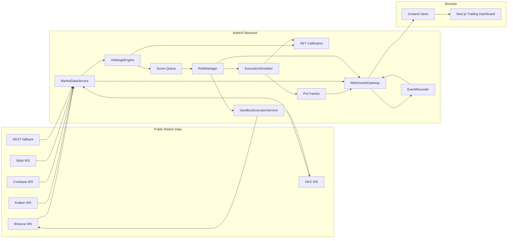
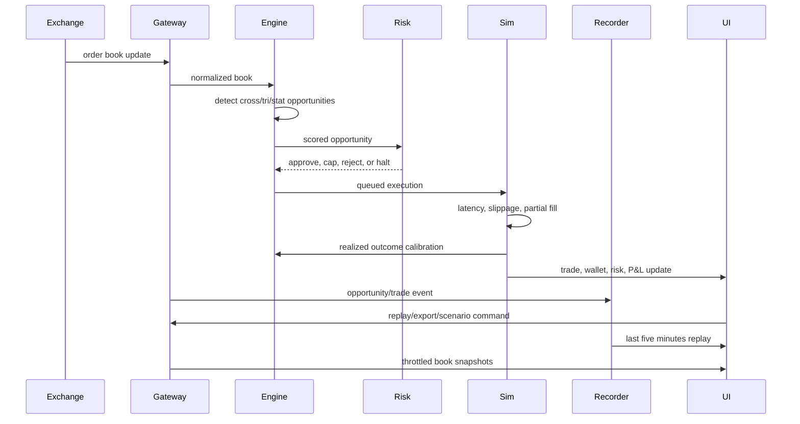

# ArbitrAI

<p align="center">
  <strong>Institutional-grade BTC arbitrage intelligence, accessible to any developer.</strong>
</p>

<p align="center">
  <a href="#quick-start">Quick Start</a> |
  <a href="#innovation-ledger">Innovation Ledger</a> |
  <a href="#architecture">Architecture</a> |
  <a href="#judge-rubric-map">Rubric Map</a> |
  <a href="#research-basis">Research Basis</a>
</p>

<p align="center">
  
  
  
  
  
</p>

ArbitrAI is a production-style Bitcoin arbitrage command center for `CODING_CHALLENGE_MEXICO`. It connects to live public exchange data, normalizes order books, detects arbitrage opportunities, ranks them with a composite score, simulates execution with realistic frictions, applies risk controls, and visualizes the full trading session in a polished browser dashboard.

This is not a toy crypto dashboard. It is a real-time paper-trading system built around the judging criteria: speed, net-profit accuracy, risk robustness, strategy sophistication, code quality, and presentation.

> Status: active hackathon build. We are still iterating, but this README preserves the key differentiators so they do not get lost.

## What Judges See First

| Capability | Why It Matters |
|---|---|
| Live exchange feeds | Binance, Kraken, Coinbase, OKX, and Bybit stream real BTC market data through the local WebSocket gateway. |
| Three strategy engine | Cross-exchange arbitrage, triangular arbitrage, and statistical mean-reversion signals. |
| Microstructure-aware scoring | The engine uses book depth, imbalance, microprice skew, fragmentation, and route pressure. |
| ArbitrAI Edge Tensor | Proprietary explainable alpha layer estimating edge survival, adverse selection, risk-adjusted P&L, and route calibration. |
| Risk-first simulator | Circuit breaker, daily loss limit, max size, latency, slippage, market impact, edge decay, and partial fills. |
| Missed opportunity desk | Rejected signals are explained by fees, adverse selection, liquidity impact, or risk controls. |
| Scenario Lab + replay | Judges can trigger crash/liquidity/latency drills and replay the last five minutes of signals. |
| Shadow Learning | Rejected and accepted signals are labeled after 0.5s/2s/5s markouts so the model learns from real live data even when it executes zero trades. |
| Sandbox Execution Bridge | Optional Binance Spot Testnet + OKX Demo order bridge, protected by env keys and safe defaults. |
| CSV export | The full session can be exported for audit in Excel/Sheets. |
| Paint-friendly real-time UI | Backend processes every market event while the frontend receives throttled, useful snapshots. |
| Clear live/demo distinction | Live mode uses real order books; demo mode uses geometric Brownian motion and synthetic dislocations. |

## Quick Start

```bash
npm install
npm run dev:ws
npm run dev
```

Open the app:

```text
http://localhost:3000
```

Health checks:

```text
Frontend:          http://localhost:3000/api/health
WebSocket backend: http://localhost:8080/health
```

The frontend defaults to:

```bash
NEXT_PUBLIC_WS_URL=ws://localhost:8080
```

The local WebSocket gateway loads `.env` on startup without overriding environment variables already injected by the hosting platform.

## Live vs Demo

| Mode | Data Source | Execution | Purpose |
|---|---|---|---|
| `LIVE` | Real public order books from exchange WebSockets and REST fallback | Simulated paper fills only | Demonstrate real market scanning and risk-aware paper trading |
| `DEMO` | Built-in geometric Brownian motion simulator | Simulated paper fills | Guarantee a reliable presentation when public APIs are quiet or unstable |

ArbitrAI never sends real-money exchange orders. The default experience is paper trading. An explicitly armed sandbox bridge can validate Binance Spot Testnet payloads and, only when deliberately configured, send orders to testnet/demo venues.

Live mode is intentionally conservative: if a visible spread does not survive fees, slippage, queue risk, adverse selection, and liquidity impact, it is rejected and explained instead of forced into a fake trade. Demo mode can generate controlled dislocations so the full execution/P&L loop is visible during judging.

## Innovation Ledger

These are the differentiators we have built so far. Keep this section updated as the system evolves.

### 1. Event-Driven Microkernel

The backend is organized around small services connected by events:

- `MarketDataService` ingests and normalizes order books.
- `ArbitrageEngine` detects and scores opportunities.
- `RiskManager` approves, caps, pauses, or rejects trading.
- `ExecutionSimulator` models fills, slippage, latency, and wallet movement.
- `PnLTracker` records outcomes and performance metrics.
- `WebSocketGateway` streams live state to the dashboard.

This keeps business logic out of React and makes each subsystem testable.

### 2. Multi-Strategy Detection

ArbitrAI does not only check `ask(A) < bid(B)`. It runs three families of signals:

| Strategy | Tag | What It Detects |
|---|---|---|
| Cross-exchange arbitrage | `CROSS_EXCHANGE` | Buy the cheaper venue and sell the richer venue after fees, slippage, and impact. |
| Triangular arbitrage | `TRIANGULAR` | BTC/USDT -> ETH/USDT -> ETH/BTC circular inefficiencies. |
| Statistical arbitrage | `STAT_ARB` | Multi-venue spread deviations across all 10 BTC venue pairs using rolling Z-score plus OU-style half-life. |

### 3. Execution Styles

Signals are tagged by execution style so the UI explains why something was executed or rejected:

- `INSTANT_TAKER`: immediate liquidity-taking arbitrage.
- `MAKER_ASSISTED`: lower-fee maker-style expected-value paper trade adjusted for queue risk.
- `TRIANGULAR_CYCLE`: intra-exchange circular rate check.
- `STAT_MEAN_REVERSION`: market-neutral spread convergence paper trade.

### 4. Composite Opportunity Score

Every opportunity receives a 0-100 score:

```text
score =
  net profitability        40%
+ visible liquidity depth  30%
+ exchange reliability     20%
+ route success memory     10%
+ microstructure boost     adaptive
```

When multiple signals appear together, the execution queue prioritizes higher-scoring opportunities.

### 5. Microstructure Edge Radar

Inspired by limit-order-book research, the dashboard now surfaces:

- **Exchange fragmentation**: distance between the richest and cheapest BTC mid prices.
- **Order-book pressure**: top-five bid depth vs top-five ask depth.
- **Microprice skew**: imbalance-adjusted near-term fair price.
- **Route edge**: best visible buy venue -> best visible sell venue.
- **Edge survival**: recent ratio of executable signals to all detected signals.

The engine also uses microstructure alignment to penalize signals that are more likely to suffer adverse selection.

### 6. ArbitrAI Edge Tensor

The newest quant layer is the `ArbitrAI Edge Tensor` (`AET` in the opportunity tape). It is an explainable model, not a black-box neural network.

For each cross-exchange route it combines:

```text
net edge bps
+ order-flow imbalance delta
+ microprice skew delta
+ top-five liquidity balance
+ EWMA short-horizon volatility
+ execution style adjustment
= survival probability + adverse-selection cost + risk-adjusted P&L
```

Outputs:

| Output | Meaning |
|---|---|
| `survivalProbability` | Probability-like estimate that the edge survives execution latency. |
| `adverseSelectionBps` | Expected short-horizon penalty if the book moves against us. |
| `riskAdjustedProfitUsd` | Conservative P&L used by the engine before approving execution. |
| `modelScore` | 0-100 AET score shown in the UI. |
| `edgeQuality` | `EXPLOIT`, `WATCH`, or `AVOID`. |
| `suggestedSizeScale` | Future hook for dynamic position sizing. |

This is the core mathematical differentiator: instead of asking only "is bid above ask?", ArbitrAI asks "will the edge still exist by the time both legs are simulated?"

### 7. AET Calibration Loop

The engine records every executed paper trade back into the route model:

```text
forecast error = realized win/loss - predicted survival probability
route bias     = EWMA(route bias, forecast error)
```

That route-specific bias nudges future `survivalProbability` up or down. In plain terms: if `Kraken -> Binance` keeps underperforming, AET becomes more skeptical of that route; if it keeps clearing profitably, AET allows more conviction.

This is deliberately lightweight for a 48-hour build, but it demonstrates the important institutional idea: the bot should learn from its own fills instead of treating every opportunity as independent.

### 8. Shadow Learning From Rejected Signals

Live markets can be quiet. If the bot only learns from executed trades, then a conservative live session with zero trades teaches nothing. ArbitrAI now runs a counterfactual learner:

```text
for every signal:
  evaluate markout after 500ms / 2s / 5s
  calculate future net profitability using real books
  label outcome as MISSED_PROFIT, AVOIDED_LOSS, FALSE_POSITIVE, CONFIRMED_EDGE
  feed a small-weight outcome into AET calibration
```

The UI shows:

- missed profit dollars;
- avoided loss dollars;
- false positives;
- model hit rate;
- latest markout label.

This is a major differentiator because live mode can prove the model is learning from real exchange data even when immediate arbitrage is not executable.

### 9. Multi-Venue Stat Arb 2.1

The original stat arb signal tracked one spread: Binance vs Kraken. The upgraded engine tracks all BTC/USDT venue pairs from the live universe:

```text
5 venues = 10 rolling spread windows
spread z-score + OU-style half-life + hedge-cost penalty = expected convergence edge
```

This turns stat arb from a single fallback signal into a true multi-venue spread scanner. It still does not fake instant arbitrage; it opens paper trades only when expected convergence survives model costs.

### 10. Depth-Aware Execution

The simulator no longer prices fills only at best bid/ask. Cross-exchange opportunities carry an `executionPlan` with top-five buy and sell levels:

- taker-style fills walk visible book depth level by level;
- maker-assisted fills use the maker reference prices and fill probability;
- high-impact trades cap size when they would consume more than 20% of top liquidity;
- partial fills update only the executed BTC/USDT amount;
- edge survival decay can turn a good expected signal into a small realized loss.

This directly addresses the hackathon requirement around partial fills and liquidity constraints.

### 11. Venue Reliability Index

Every exchange status carries a live reliability score:

| State | Score Meaning |
|---|---|
| WebSocket live | Highest confidence, active stream. |
| REST polling | Usable fallback, lower confidence. |
| Reconnecting | Degraded venue, penalized. |
| Error | Avoid until recovered. |

The UI shows this as `R96`, `R76`, etc. The scoring model also keeps a static venue reliability component so routes through more reliable venues rank higher.

### 12. Event Recorder and Replay

`EventRecorder` keeps an in-memory five-minute rolling session of opportunities and trades. The `REPLAY` control asks the backend to send that history back to the frontend, so judges can inspect the system even if the live market is quiet.

### 13. Missed Opportunity Desk

Rejected signals are not hidden. The center panel summarizes the latest rejected opportunities and classifies the reason:

- `fees`: gross edge was erased by taker/maker fees and amortized withdrawal cost;
- `liquidity`: high-impact or insufficient visible depth;
- `adverse`: AET survival/adverse-selection model rejected the route;
- `breaker`: risk controls blocked execution;
- `threshold`: net edge was below the execution threshold.

This makes the bot look intelligent rather than greedy.

### 14. Scenario Lab

The bottom dock includes three controlled drills:

| Drill | Effect |
|---|---|
| `CRASH x3` | In demo, volatility rises 3x and spreads widen; in live, risk state records a crash drill without falsifying market data. |
| `LIQUIDITY` | Demo liquidity drops and spreads widen, increasing high-impact rejections. |
| `LATENCY` | Execution latency is multiplied, increasing markout and edge-decay risk. |

### 15. Session Export

`EXPORT CSV` downloads the full session audit trail:

```text
timestamp, kind, type, route, status, size_btc, pnl_usd, fees_usd, score, net_spread_pct, edge_survival, edge_quality
```

This is included so jurors can inspect the economics outside the dashboard.

### 16. Sandbox Execution Bridge

The system now has a protected path from paper trading toward real exchange execution without risking real capital.

Default behavior is still safe:

```text
Execution mode: PAPER
Sandbox order mode: DRY_RUN
Real-money orders: impossible from this code path
```

When test credentials are provided, the backend can arm `SANDBOX` mode:

| Venue | Environment | Endpoint Purpose |
|---|---|---|
| Binance | Spot Testnet | Signed limit IOC orders or `/api/v3/order/test` validation. |
| OKX | Demo Trading | Signed demo orders with `x-simulated-trading: 1`. |

Safety controls:

- sandbox is disabled unless API keys are present;
- default `DRY_RUN` plans payloads but submits nothing;
- `TEST_ORDER` validates Binance payloads without a live testnet fill; the OKX demo leg remains planned and is not submitted;
- `LIVE_SANDBOX` submits only to testnet/demo venues;
- max sandbox notional defaults to `$25`;
- only Binance <-> OKX cross-exchange routes are eligible first;
- authenticated sandbox balances can be refreshed from both venues without exposing keys to the browser;
- a separate sandbox kill switch blocks order submission independently from the paper-trading circuit breaker;
- `RECONCILE` labels validation-only runs and, in `LIVE_SANDBOX`, compares both exchange fills;
- fill divergence pauses sandbox execution and produces a hedge plan for manual review instead of firing an uncontrolled follow-up order;
- real withdrawal permission is never required and should never be granted.

Environment variables:

```bash
SANDBOX_ORDER_MODE=DRY_RUN
SANDBOX_MAX_NOTIONAL_USD=25
BINANCE_TESTNET_API_KEY=
BINANCE_TESTNET_API_SECRET=
OKX_DEMO_API_KEY=
OKX_DEMO_API_SECRET=
OKX_DEMO_API_PASSPHRASE=
```

### 17. Risk Controls That Judges Can Test

| Risk Control | Implementation |
|---|---|
| Circuit breaker | Pauses trading after 3 material consecutive losses. |
| Manual reset | `RESET RISK` resumes paper execution after review. |
| Daily loss limit | Halts when simulated daily P&L breaches the configured limit. |
| Max size | Caps each simulated trade at 0.1 BTC. |
| High-impact warning | Flags and reduces trades consuming more than 20% of top liquidity. |
| Latency simulation | Adds randomized 50-350ms network/execution delay depending on execution style, multiplied by latency drills. |
| Slippage model | Uses depth-sensitive 0.02%-0.05% slippage. |

### 18. Wallet and Rebalancing Simulation

Each exchange has independent BTC and USDT balances. After simulated execution:

- buy-side USDT decreases and BTC increases;
- sell-side BTC decreases and USDT increases;
- fees and latency cost are applied immediately;
- partial fills update only the filled amount;
- low BTC/USDT balances trigger `REBALANCING NEEDED`;
- the UI estimates rebalance cost.

### 19. Paint-Friendly Realtime UI

The backend still processes every raw market event, but the browser receives a lighter stream:

- BTC order books are throttled to a paint-friendly cadence.
- Rejected opportunities are sampled; executable opportunities are immediate.
- React renders compact snapshots instead of every raw exchange tick.
- The UI uses a single-screen command-center layout with internal scroll regions.

This keeps the agent fast without hiding the real-time engine.

## Architecture



## Data Flow



## Project Structure

```text
.
|- backend/
|  `- server.ts                 # WebSocket gateway + exchange connectors
|- src/
|  |- app/                      # Next.js App Router
|  |- components/
|  |  `- Dashboard.tsx          # Single-page trading command center
|  |- lib/
|  |  |- config/exchanges.ts    # Fees, reliability, wallet seeds
|  |  |- math/decimal.ts        # Decimal.js financial helpers
|  |  |- services/              # Core trading services
|  |  `- types.ts               # Shared gateway/domain types
|  `- store/useArbitrageStore.ts
|- tests/                       # Unit tests for math, engine, risk
|- Dockerfile
|- railway.json
|- vercel.json
`- DESIGN.md                    # Visual system for future iterations
```

## Judge Rubric Map

| Evaluation Criterion | ArbitrAI Evidence |
|---|---|
| Detection speed | Event-driven in-memory processing, measured detection latency, optimized UI broadcasts, five live venues. |
| Net profit accuracy | Decimal.js, maker/taker fees, slippage, withdrawal amortization, latency, market-impact penalties, depth-walk fills. |
| Robust business logic | Wallet balances, partial fills, capped size, circuit breaker, daily loss limit, rebalance warnings, scenario drills. |
| Bot intelligence | Cross-exchange, triangular, multi-venue OU-style stat arb, maker-assisted execution, AET survival model, shadow learning, missed-opportunity explanations. |
| Code quality | Strict TypeScript, separate service classes, unit tests, explicit types, sandbox execution guardrails, deployment configs. |
| UI/UX | Light institutional command center, edge radar, strategy matrix, missed-opportunity desk, shadow learning, execution bridge, P&L cockpit, live/demo clarity, CSV export. |

## Performance Benchmarks

Latest local observations from this iteration:

| Observation | Result |
|---|---:|
| Live venues connected | 5/5 WebSocket live |
| Live sample length | 15s |
| Live UI book messages sampled | 339 |
| Live opportunity messages sampled | 195 |
| Live stat-arb signals sampled | 50 |
| Live cumulative opportunities scored | 723 |
| Live executable paper trades | 13 |
| Live paper net P&L | $1.60 |
| Live paper win rate | 69.23% |
| Live Shadow Learning labels | 674 |
| Live avoided-loss dollars | $1,592.45 |
| Live average detection latency | 3.37ms |
| Sandbox execution default | PAPER + DRY_RUN, no credentials required |
| Demo scenario sample | 8s liquidity-drain drill |
| Demo opportunities scored | 246 |
| Demo stat-arb signals | 231 |
| Demo simulated trades | 49 |
| Demo win rate after edge-decay model | 91.84% |
| Demo net P&L | $61.34 |
| Demo avoided-loss labels | 250 |
| Demo avoided-loss dollars | $4,602.39 |
| Demo average detection latency | 2.29ms |

Target processing latency remains under 5ms from normalized order-book ingestion to opportunity emission. Live trade count can still be zero in quieter windows when real spreads do not survive fees and risk controls; that is expected behavior, not a failure.

## Research Basis

The implementation is intentionally practical for a 48-hour challenge, but the ideas come from real market microstructure and crypto arbitrage research:

- **Crypto arbitrage is not free money.** Transaction costs, capital constraints, latency, withdrawal frictions, and settlement risk explain why visible price differences can persist.
- **Quote imbalance matters.** Top-of-book and multi-level imbalance can forecast very short-horizon pressure.
- **Microprice is more informative than midprice.** Size-weighted bid/ask pressure gives a better local estimate of near-term fair value.
- **Stat arb should be adaptive.** Crypto spreads are non-stationary, so spread signals need rolling windows and confidence controls.

References:

- [Limits to Arbitrage for Blockchain-Based Assets](https://arxiv.org/abs/1812.00595)
- [Trade Arrival Dynamics and Quote Imbalance in a Limit Order Book](https://arxiv.org/abs/1312.0514)
- [High resolution microprice estimates from limit orderbook data](https://arxiv.org/abs/2411.13594)
- [Market impact and efficiency in cryptoassets markets](https://link.springer.com/article/10.1007/s42521-023-00095-9)
- [Exploring sources of statistical arbitrage opportunities among Bitcoin exchanges](https://www.sciencedirect.com/science/article/pii/S1544612322005116)
- [Deep learning-based pairs trading in cryptocurrency markets](https://www.frontiersin.org/journals/applied-mathematics-and-statistics/articles/10.3389/fams.2026.1749337/full)

Exchange API references:

- [Binance Spot API official docs and Spot Testnet](https://github.com/binance/binance-spot-api-docs)
- [OKX WebSocket public API](https://www.okx.com/docs-v5/en/#websocket-api-public-channel)
- [OKX Trade API place order](https://www.okx.com/docs-v5/en/#order-book-trading-trade-post-place-order)
- [Bybit V5 public orderbook WebSocket](https://bybit-exchange.github.io/docs/v5/websocket/public/orderbook)

## Documentation and Design Inspiration

This README and the project-level `DESIGN.md` borrow structure from documentation/design-system references:

- [VoltAgent/awesome-design-md](https://github.com/VoltAgent/awesome-design-md): keep an explicit markdown design system so AI agents and humans preserve visual consistency.
- [matiassingers/awesome-readme](https://github.com/matiassingers/awesome-readme): first-screen clarity, badges, architecture, quickstart, and strong project positioning.
- GitHub-native Mermaid diagrams: architecture and data flow stay readable inside the repository.

## Deployment

Frontend on Vercel:

```bash
vercel
```

Backend on Railway:

```bash
railway up
```

Included:

- `vercel.json`
- `Dockerfile`
- `railway.json`
- `.env.example`

## Environment Variables

```bash
NEXT_PUBLIC_WS_URL=ws://localhost:8080
WS_PORT=8080
```

## Testing

```bash
npm run check
npm run build
```

Current test focus:

- `ArbitrageEngine.calculateNetProfit()`
- fee and slippage math
- `EdgeTensor` survival scoring
- `RiskManager.shouldHalt()`
- sandbox kill switch, balance parsing, and validation-only reconciliation

## Known Limitations

- ArbitrAI defaults to paper trading. Its optional authenticated bridge is intentionally limited to Binance Spot Testnet and OKX Demo Trading.
- Live mode currently streams BTC/USDT or BTC/USD books from Binance, Kraken, Coinbase, OKX, and Bybit. Binance also streams ETH legs for live triangular checks; demo mode provides full synthetic triangular coverage across all venues.
- Sandbox credentials are environment-specific: Binance Spot Testnet and OKX Demo Trading keys must be created in their matching simulated environments.
- Real-money production trading would still require persistence, alerts, custody controls, rate-limit management, a reviewed hedge policy, and a staged capital rollout.
- Reported P&L is simulated and should not be interpreted as real trading profit.
- The replay store is in-memory for hackathon speed. A production version would persist event logs to a database or object store.

## Roadmap

| Next Upgrade | Why |
|---|---|
| Persistent event database | Keep replay/export history after backend restarts. |
| Visual replay timeline | Scrub through the last five minutes instead of replaying as one burst. |
| More live ETH legs | Enable live triangular checks on OKX/Bybit when their ETH books are connected. |
| Dynamic position sizing | Use AET `suggestedSizeScale` to size execution continuously. |
| Venue reliability memory | Learn reliability from stale-book duration and reconnect history over a full session. |
| Deployment screenshots/video | Give judges instant visual proof in the README. |

## Competition Identity

```text
Project: ArbitrAI
Tagline: Institutional-grade BTC arbitrage intelligence, accessible to any developer
Challenge: CODING_CHALLENGE_MEXICO
Author: Joahan Samuel Morales Pina
```
