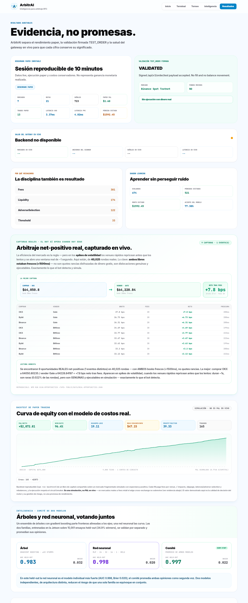
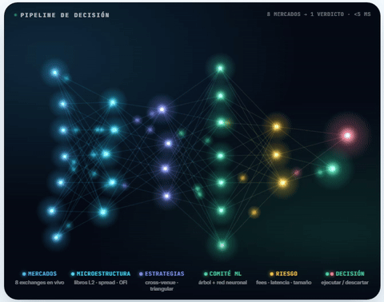
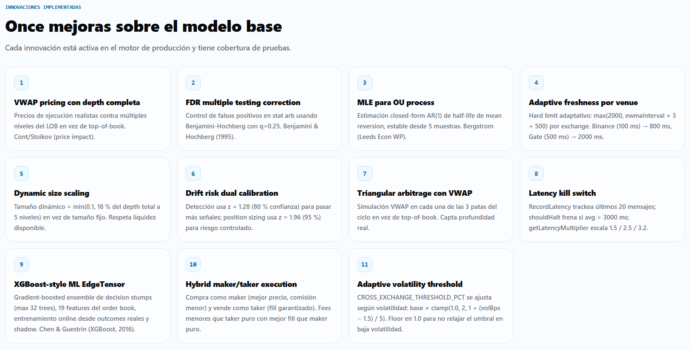
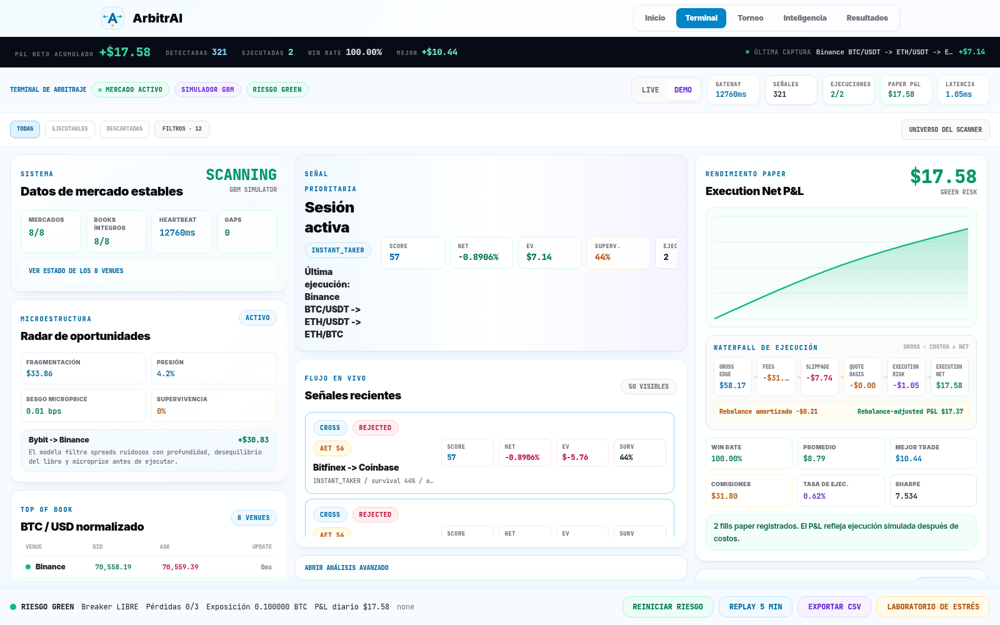

# ArbitrAI

<p align="center">
  <strong>Inteligencia de arbitraje BTC con calidad institucional, accesible para cualquier developer.</strong>
</p>

<p align="center">
  <a href="https://github.com/JoahanMorales">GitHub</a> ·
  <a href="https://www.linkedin.com/in/joahan-morales/">LinkedIn</a>
</p>

<p align="center">
  
  
  
  
  
</p>

ArbitrAI es un sistema de arbitraje BTC event-driven para `CODING_CHALLENGE_MEXICO`. Conecta feeds públicos reales, normaliza `order books`, detecta oportunidades, calcula rentabilidad neta con fricciones realistas y explica por qué una señal se ejecuta o se descarta.

La entrega pública separa con claridad:

- `Live market data`: precios reales recibidos por `WebSocket` o `REST fallback`.
- `Paper P&L`: fills simulados sobre datos reales o sobre el simulador.
- `Signed TEST_ORDER`: validación autenticada sin mover fondos.
- `Demo`: escenario controlado para mostrar el ciclo completo cuando el mercado está quieto.

<p align="center">
  
</p>

## Demo web

| Ruta | Propósito |
|---|---|
| `/` | Landing simple con visualización del flujo AET. |
| `/terminal` | Trading terminal con datos en tiempo real. |
| `/inteligencia` | Explicación técnica animada del modelo. |
| `/resultados` | Benchmark reproducible y prueba separada de `TEST_ORDER`. |

## Resultados con datos reales

Todo esto es reproducible desde `scripts/` y visible en `/resultados` — no promesas, evidencia auditable.

<p align="center">
  
</p>

- **8 exchanges en vivo** por WebSocket (Binance, Kraken, Coinbase, OKX, Bybit, Bitfinex, Gate, Bitstamp), con cálculo de rentabilidad **neta de fees, base USDT/USD, slippage y riesgo de ejecución**.
- **Capturas reales de arbitraje** (`npm run scan:opportunities`): sobre 60,716 rondas reales el bot detectó **23 dislocaciones net-positivas genuinas** en un spike de volatilidad — p. ej. **comprar Binance @$63,995 / vender Bitfinex @$64,319 = +20.53 bps neto tras fees**, con ambos libros frescos (<200ms, no quotes rancias). Los venues rápidos repricean antes que los lentos: ventanas de ~1s, raras pero reales — justo lo que el reto describe.
- **Eficiencia cuantificada, honestamente** (`study:fee`, `study:maker`): sobre **3.6M de dislocaciones reales**, el edge bruto mediano es 1.4 bps → break-even ≤1.3 bps round-trip; a fees retail el arbitraje cross **y** el market-making pasivo son estructuralmente no rentables. El valor del sistema es **detectar el edge real cuando existe y rechazar con precisión el resto** — la disciplina de riesgo es el producto.

## Diferenciadores

### 1. ArbitrAI Edge Tensor

AET estima si un edge visible sobrevivirá el tiempo suficiente para ejecutarse. Combina:

- `OFI` y `MLOFI` top-5;
- `microprice skew`;
- liquidez disponible e impacto;
- volatilidad reciente;
- `quote age` y `quote skew` entre venues;
- calibración por ruta usando `markouts`.

El resultado incluye `survival probability`, `fill probability`, `leg risk`, `adverse selection`, `Expected Value`, `suggested size` y un score explicable de `0-100`. La queue usa `Expected Value`, no el spread bruto.

<p align="center">
  
</p>

### 2. Cuatro estrategias

| Estrategia | Criterio |
|---|---|
| `CROSS_EXCHANGE` | Compra el mejor `ask` y vende el mejor `bid` en otro venue. |
| `TRIANGULAR` | Evalúa el ciclo `BTC/USDT -> ETH/USDT -> ETH/BTC -> BTC`. |
| `STAT_ARB` | Busca mean reversion multi-venue con `Z-score`, estimación OU y costos de round trip. |
| `LATENCY_ARB` | Ataca el espacio asíncrono que cross-exchange rechaza: levanta un `ask` rancio (`skew > 1800ms`) contra un `bid` fresco, cobrando una prima de riesgo de staleness y exigiendo `1.5x` el umbral. |

### 3. Motor realista y auditable

- `Decimal.js` para evitar errores de floating point.
- Normalización real `USD/USDT`: los feeds conservan su `source price`, pero el scanner compara una referencia común en USD usando el basis `USDT/USD`.
- Reconstrucción de `order books` con `sequence gaps`; Kraken valida `CRC32` sobre su profundidad suscrita.
- Trading fees, quote basis, slippage, latency y market impact como `execution cost`.
- `Withdrawal amortization` separado como `rebalance cost`: `Execution Net P&L` y `Rebalance-adjusted P&L` nunca se mezclan.
- Fills parciales, wallets prefunded y alerta de rebalancing.
- `Execution state machine`: `DETECTED -> PREFLIGHT -> VALIDATED -> RESERVED -> LEG_A -> LEG_B -> RECONCILED`.
- `Preflight` real de ambas piernas antes de admitir una señal a la queue.
- `Circuit breaker` tras tres pérdidas materiales.
- Límite diario de pérdida y máximo `0.1 BTC` por trade.
- `Shadow Learning`: aprende también de señales descartadas.
- CSV de sesión, journal persistente y calibración recuperable con schema versionado para no reutilizar observaciones incompatibles tras cambiar el modelo.

### 4. Innovaciones implementadas (hackathon)

| # | Innovación | Impacto | Papers |
|---|---|---|---|
| 1 | **VWAP pricing con depth completa** | Precios de ejecución realistas contra múltiples niveles del LOB en vez de top-of-book | Cont/Stoikov (price impact) |
| 2 | **FDR multiple testing correction** | Control de falsos positivos en stat arb usando Benjamini-Hochberg (q=0.25) | Benjamini & Hochberg (1995) |
| 3 | **MLE para OU process** | Estimación closed-form AR(1) de half-life de mean reversion, estable desde 5 muestras | Bergstrom (Leeds Econ WP) |
| 4 | **Adaptive freshness por venue** | Hard limit adaptativo: `max(2000, ewmaInterval * 3 + 500)` por exchange. Binance (100ms) → 800ms, Gate (500ms) → 2000ms | |
| 5 | **Dynamic size scaling** | Tamaño dinámico = `min(0.1, 18% del depth total a 5 niveles)` en vez de `min(0.1, ask.size, bid.size)` flat | |
| 6 | **Drift risk dual calibration** | Detección usa z=1.28 (80% confianza) para pasar más señales; position sizing usa z=1.96 (95%) para riesgo controlado | |
| 7 | **Triangular arbitrage con VWAP** | Simulación VWAP en cada una de las 3 patas del ciclo en vez de top-of-book | |
| 8 | **Latency kill switch** | `recordLatency()` trackea últimos 20 mensajes; `shouldHalt()` frena si avg > 3000ms; `getLatencyMultiplier()` escala 1.5/2.5/3.2 | |
| 9 | **XGBoost-style ML EdgeTensor (ensemble de dos modelos)** | Gradient-boosted ensemble de decision stumps (max 32 trees), 19 features del order book, entrenamiento online desde outcomes reales y shadow. Una vez entrenado actúa como segunda opinión: su `survival` se mezcla en la confianza y puede **vetar** una señal que AET admitió (nunca resucita una que AET rechazó). Inactivo hasta tener suficientes outcomes, así el hot path afinado no cambia hasta entonces. | Chen & Guestrin (XGBoost, 2016) |
| 10 | **Hybrid maker/taker execution** | Compra como maker (mejor precio, baja fee) y vende como taker (fill garantizado) — fees menores que taker puro con mejor fill que maker puro | |
| 11 | **Adaptive volatility threshold** | `CROSS_EXCHANGE_THRESHOLD_PCT` se ajusta según volatilidad: `base * clamp(1.0, 2, 1 + (volBps - 1.5)/5)`. Floor en 1.0 para no relajar el umbral en baja volatilidad | |
| 12 | **Square-root law de market impact** | El slippage escala con `√(participación)`, no lineal — ley casi universal confirmada específicamente en Bitcoin. Un modelo lineal subestima el costo de consumir profundidad | Donier & Bonart (2015), Tóth et al. (2011), Almgren et al. (2005) |
| 13 | **Gate de cointegración (ADF)** | Stat arb solo opera spreads que rechazan raíz unitaria: t-stat de Dickey-Fuller sobre el AR(1) con deriva (`t < -2.0` ⇒ estacionario/cointegrado). Veta regímenes desacoplados | Dickey & Fuller (1979), Engle & Granger (1987) |
| 14 | **Sizing de Kelly fraccional** | Tamaño = `f* = p − (1−p)/b` (Kelly), con `p` = supervivencia del ensemble y `b` = odds edge/downside, escalando la base de profundidad y acotado a `[0.3, 1]` | Kelly (1956), Thorp (2006) |
| 15 | **Maker pricing Avellaneda-Stoikov** | La pata maker deriva su agresividad del half-spread óptimo `δ = ½[γσ²(T−t) + (2/γ)ln(1+γ/κ)]` — más pasiva en alta volatilidad, más ajustada en libros profundos — con skew por order-flow imbalance | Avellaneda & Stoikov (2008) |
| 16 | **Features de order-flow imbalance** | El ML consume OFI a la punta y multi-level OFI ponderado a 5 niveles + microprice en ambos libros y su alineación (antes inertes en 0) | Cont-Kukanov-Stoikov (2014), Xu-Gould-Howison (2018) |
| 17 | **Búsqueda de semillas del modelo ML** | `npm run train:search` entrena N seeds independientes, puntúa cada uno (AUC held-out + demo-safety) y solo promueve un modelo si supera al actual — nunca regresa | |
| 18 | **Aislamiento de fallos en la cola de ejecución** | `drainQueue()` envuelve cada trade en `try/catch` propio y el loop entero en `try/finally`: una excepción en una pierna rechaza esa señal sin congelar `executing` ni el resto de la cola. React boundary (`error.tsx`) evita pantalla blanca si un panel falla al renderizar | |
| 19 | **Calibración de Platt + punto de operación** | La salida del ensemble no era probabilidad calibrada (Brier 0.060 eval) y Kelly la consume como probabilidad. Capa `survival = sigmoid(a·margen + b)` ajustada por MLE en fold disjunto, adjuntada solo si mejora el Brier out-of-sample: 0.060 → 0.023 (−61%) en el tape real de 6h, ranking intacto. El barrido de umbrales (`--opOut`) mide el P&L contrafactual de las señales seleccionadas a cada nivel de confianza vs el gate actual | Platt (1999) |
| 20 | **Calibración isotónica en competencia + validación walk-forward + transferencia** | La isotónica (PAV) compite con Platt en el mismo fold de calibración y solo se adjunta la que gana en el fold de evaluación intocado. `--split temporal` hace la validación walk-forward (entrena < calibra < evalúa en orden cronológico estricto); `--evalTape` liquida un tape ajeno con el modelo congelado (transferencia de régimen); IC95 de Wilson en cada win-rate del barrido | Zadrozny & Elkan (2002), Wilson (1927) |
| 21 | **Features temporales v3 (el modelo ve el tiempo)** | Los 19 features eran fotos de una sola ronda; OFI se define sobre intervalos. `observeBook()` mantiene historia rodante por venue (throttle 400ms, ventana ~8s) y deriva 5 features nuevos: momentum del mid por venue, delta de imbalance por venue y volatilidad realizada — una dislocación que aparece CON momentum hacia la convergencia muere rápido; una que aparece mientras los libros se separan persiste | Cont-Kukanov-Stoikov (2014) |
| 22 | **NeuralEdge: segundo modelo deep + comité de dos familias** | Junto al ensemble de árboles corre una **red neuronal** (MLP `24→32→16→1`, ReLU, sigmoid) escrita en **TypeScript puro** — backprop + Adam a mano, cero dependencias, misma inferencia en browser y gateway. Los árboles parten fronteras alineadas a los ejes; la red las curva, así que discrepan de forma útil y se promedian en un **comité**. Entrenada en la Jetson: `npm run train:neural`; `npm run study:neural` puntúa árbol vs red vs comité sobre un held-out fresco (la red gana: AUC 0.998 vs 0.983, Brier 0.019 vs 0.032) y `/resultados` lo muestra. La ruta GPU (PyTorch/CUDA en la Jetson) queda lista para habilitar | Rumelhart et al. (backprop, 1986), Kingma & Ba (Adam, 2015) |

<p align="center">
  
</p>

#### Papers base

- Cont, Kukanov y Stoikov: [The Price Impact of Order Book Events](https://arxiv.org/abs/1011.6402)
- Xu, Gould y Howison: [Multi-Level Order-Flow Imbalance in a Limit Order Book](https://arxiv.org/abs/1907.06230)
- Lipton, Pesavento y Sotiropoulos: [Trade arrival dynamics and quote imbalance](https://arxiv.org/abs/1312.0514)
- Bechler y Ludkovski: [Order Flows and Limit Order Book Resiliency on the Meso-Scale](https://arxiv.org/abs/1708.02715)
- Lokin y Yu: [Fill Probabilities in a Limit Order Book with State-Dependent Stochastic Order Flows](https://arxiv.org/abs/2403.02572)
- Makarov y Schoar: [Trading and Arbitrage in Cryptocurrency Markets](https://doi.org/10.1016/j.jfineco.2019.07.001)
- Donier y Bonart: [A Million Metaorder Analysis of Market Impact on Bitcoin](https://arxiv.org/abs/1412.4503) — confirma la `√`-law en BTC (exponente ≈ 0.5)
- Tóth et al.: [Anomalous Price Impact and the Critical Nature of Liquidity](https://arxiv.org/abs/1105.1694)
- Almgren et al.: [Direct Estimation of Equity Market Impact](https://www.cis.upenn.edu/~mkearns/finread/costestim.pdf)
- Engle y Granger: [Co-integration and Error Correction](https://www.jstor.org/stable/1913236) (1987) · Dickey y Fuller (1979)
- Kelly: [A New Interpretation of Information Rate](https://ieeexplore.ieee.org/document/6771227) (1956) · Thorp (2006)
- Kraken API Center: [Spot WebSockets v2 Book Checksum](https://docs.kraken.com/api/docs/guides/spot-ws-book-v2/)

## Arquitectura


El backend reconstruye feeds live y coalesce actualizaciones por símbolo antes de recalcular las rutas tocadas. La UI recibe `BOOK_BATCH` throttled, desactiva animaciones costosas en charts y memoiza paneles independientes para mantener React fluido sin convertir el navegador en el cuello de botella.

<p align="center">
  
</p>

## Quick start

```bash
npm install
npm run dev:ws
npm run dev
```

Abrir:

```text
http://localhost:3000
```

Health checks:

```text
Frontend: http://localhost:3000/api/health
Gateway:  http://localhost:8080/health
Summary:  http://localhost:8080/public/summary
```

Validación:

```bash
npm run check
npm run build
```

## Entrenamiento del modelo

```bash
npm run train               # 45s, generador sintético enriquecido (camino 2)
npm run train -- 90         # entrena 90s
npm run train:search                      # busca el mejor modelo entre 12 seeds x 90s (~18 min)
npm run train:search -- 20 120            # 20 seeds x 120s (~40 min) — solo promueve si mejora el actual
npm run train:search:max                  # Jetson: 36 seeds x 180s en paralelo sobre todos los cores
npm run train:neural                      # entrena la red neuronal (NeuralEdge MLP) -> public/model/neural-edge.json
npm run study:neural                      # árbol vs red vs comité en held-out -> public/data/neural-study.json
npm run record -- 120       # graba 120s de los 8 exchanges reales -> data/tape-*.jsonl (camino 1)
npm run train -- --tape data/tape-XXXX.jsonl   # entrena sobre datos reales grabados
npm run analyze:tape data/tape-XXXX.jsonl      # analiza el tape -> public/data/tape-analysis.json
npm run study:reversion data/tape-XXXX.jsonl   # entrena reversión sobre datos reales (AUC held-out)
npm run study:triangular                       # edge hunt: triangular intra-venue por tier de fees (datos reales)
npm run study:portfolio                        # síntesis: portafolio multi-estrategia en vivo, ¿diversificar gana?
npm run record:ws                              # graba feeds WebSocket independientes (latency edges)
npm run backtest                               # backtest de paper trading -> public/data/backtest.json (curva de equity)
bash scripts/overnight-run.sh                  # pipeline nocturno (~12h): 6h de tape real + 6h triangular + 30 seeds en paralelo, luego análisis + reversión + reentrenamiento sobre el tape
```

**Camino 2 — generador sintético.** El harness conduce el motor + simulador
directamente (latencia comprimida, costo intacto) y genera un Monte-Carlo de
dislocaciones cross-exchange **centradas en el break-even** de cada par (fees +
costos), con la misma estructura de libros que la demo en vivo. Cada par
inyectado se liquida como un ensayo etiquetado (ganadores y perdedores) y la
discriminación se valida con **AUC sobre un held-out disjunto por rondas** (nunca
entrenado). Solo persiste el ensemble si rankea ganadores sobre perdedores
(AUC ≥ 0.65) **y** pasa un *demo-safety guard* que garantiza que no vetará las
señales legítimas de la demo. Run típico: AUC held-out ≈ 0.99, separación
ganador/perdedor ≈ 86 % vs 8 %, demo-safety ≈ 96 %.

**Camino 1 — datos reales.** `npm run record` captura los order books reales de
los 8 exchanges (normalizados con la misma base USDT/USD que el gateway) a un
tape reproducible; `--tape` lo reproduce por el mismo pipeline. Hallazgo honesto
y verificado: a tarifas retail, **todas** las dislocaciones cross-exchange reales
son no rentables tras fees + base (net spread −25 a −113 bps) — el mercado es
eficiente, así que el valor del sistema está en rechazarlas con precisión (lo que
el AET calibra con esos outcomes reales), no en un edge inexistente.

La **calibración AET por ruta** y el **ensemble ML validado** se persisten en
`public/model/edge-model.json`; la demo (cliente) y el gateway (backend) hacen
*warm-start* desde ese archivo, así arrancan pre-calibrados en vez de en frío.
`npm run analyze:tape` escribe `public/data/tape-analysis.json`, que la página
`/resultados` renderiza como **evidencia de mercado real**: la distribución de
net-spreads cross-exchange reales (todas las barras a la izquierda del break-even).
`npm run study:reversion` entrena el ensemble sobre datos reales para predecir la
reversión del spread y reporta un **AUC held-out** (~0.60, out-of-sample): señal
genuina aunque no rentable a fees retail, también surfaceada en `/resultados`.
`/inteligencia` muestra el Brier del AET y del ML por separado, en vivo.

La página `/torneo` corre un **torneo de estrategias en vivo**: las 4 estrategias
compiten con su P&L real de paper trading, con podio, medallas, rachas y cambios
de ranking en tiempo real (responsive, mobile-first).

`/resultados` también muestra un **backtest de paper trading** (`npm run backtest`):
curva de equity acumulada, win rate, Sharpe-like, max drawdown y profit factor
sobre el simulador con el modelo de costos real + *implementation shortfall*.
**Es una simulación, no P&L en vivo** — se presenta junto a la evidencia de mercado
real (a fees retail el arbitraje cross-exchange no es rentable), para que la página
sea honesta: demuestra la calidad de decisión y la gestión de riesgo del motor.

## Live y Demo

| Modo | Fuente | Uso |
|---|---|---|
| `LIVE` | Binance, Kraken, Coinbase, OKX, Bybit, Bitfinex y Gate | Escaneo real y `paper trading` conservador. |
| `DEMO` | Geometric Brownian motion con dislocations controladas | Presentación reproducible y stress tests. |

En `LIVE`, cero trades puede ser un resultado correcto: significa que ningún spread sobrevivió fees, slippage, latency, liquidity impact y `adverse selection`. ArbitrAI no inventa ganancias para llenar una gráfica.

## Seguridad

Vercel recibe únicamente URLs públicas:

```bash
NEXT_PUBLIC_WS_URL=wss://<railway-domain>
NEXT_PUBLIC_API_URL=https://<railway-domain>
```

Railway conserva secretos y journal:

```bash
SANDBOX_ORDER_MODE=TEST_ORDER
BINANCE_TESTNET_API_KEY=...
BINANCE_TESTNET_API_SECRET=...
ADMIN_CONTROL_TOKEN=<random-secret>
ALLOWED_WEB_ORIGINS=https://<vercel-domain>,http://localhost:3000
ARBITRAI_DATA_DIR=/data
```

Nunca colocar API keys en variables `NEXT_PUBLIC_*`. El control administrativo del socket usa token, comparación constante y rate limit.

## Deploy

Frontend:

```bash
vercel
```

Gateway persistente:

```bash
railway up
```

Adjuntar un Railway Volume en `/data` para journal y calibración.

## Rubric del challenge

| Criterio | Evidencia |
|---|---|
| Velocidad | Feeds live, procesamiento event-driven, `BOOK_BATCH` visual y latency visible. |
| Precisión | `Decimal.js`, normalización `USD/USDT`, fees por venue, waterfall de costos, quote freshness e impacto. |
| Robustez | Libros reconstruidos, `CRC32`, sequence gaps, fills parciales, two-leg `preflight`, reconciliation y `circuit breaker`. |
| Estrategia | Cross-exchange, triangular, stat arb, AET y Shadow Learning. |
| Arquitectura | Servicios separados, protocolo WebSocket tipado, tests y health checks. |
| UX | Cuatro rutas enfocadas, filtros locales, explicaciones de rechazo y replay. |

## Límites honestos

- El deploy público no envía órdenes con dinero real.
- `Paper P&L` no equivale a profit realizado.
- `TEST_ORDER` prueba firma y payload; no acredita fills.
- Operar capital real requeriría rollout gradual, custody controls, alertas, hedge policy revisada y monitoreo operativo.

---

**Autor:** Joahan Samuel Morales Piña
**Proyecto:** ArbitrAI · `CODING_CHALLENGE_MEXICO`
