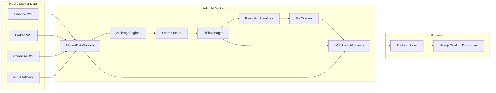
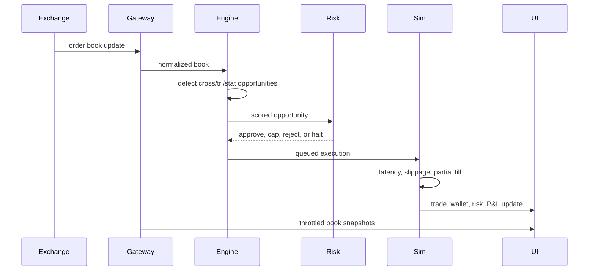

# ArbitrAI

<p align="center">
  <strong>Institutional-grade BTC arbitrage intelligence, accessible to any developer.</strong>
</p>

<p align="center">
  <a href="#quick-start">Quick Start</a> |
  <a href="#innovation-ledger">Innovation Ledger</a> |
  <a href="#architecture">Architecture</a> |
  <a href="#judge-rubric-map">Rubric Map</a> |
  <a href="#research-basis">Research Basis</a>
</p>

<p align="center">
  
  
  
  
  
</p>

ArbitrAI is a production-style Bitcoin arbitrage command center for `CODING_CHALLENGE_MEXICO`. It connects to live public exchange data, normalizes order books, detects arbitrage opportunities, ranks them with a composite score, simulates execution with realistic frictions, applies risk controls, and visualizes the full trading session in a polished browser dashboard.

This is not a toy crypto dashboard. It is a real-time paper-trading system built around the judging criteria: speed, net-profit accuracy, risk robustness, strategy sophistication, code quality, and presentation.

> Status: active hackathon build. We are still iterating, but this README preserves the key differentiators so they do not get lost.

## What Judges See First

| Capability | Why It Matters |
|---|---|
| Live exchange feeds | Binance, Kraken, and Coinbase stream real BTC market data through the local WebSocket gateway. |
| Three strategy engine | Cross-exchange arbitrage, triangular arbitrage, and statistical mean-reversion signals. |
| Microstructure-aware scoring | The engine uses book depth, imbalance, microprice skew, fragmentation, and route pressure. |
| ArbitrAI Edge Tensor | Proprietary explainable alpha layer estimating edge survival, adverse selection, and risk-adjusted P&L. |
| Risk-first simulator | Circuit breaker, daily loss limit, max size, latency, slippage, market impact, and partial fills. |
| Paint-friendly real-time UI | Backend processes every market event while the frontend receives throttled, useful snapshots. |
| Clear live/demo distinction | Live mode uses real order books; demo mode uses geometric Brownian motion and synthetic dislocations. |

## Quick Start

```bash
npm install
npm run dev:ws
npm run dev
```

Open the app:

```text
http://localhost:3000
```

Health checks:

```text
Frontend:          http://localhost:3000/api/health
WebSocket backend: http://localhost:8080/health
```

The frontend defaults to:

```bash
NEXT_PUBLIC_WS_URL=ws://localhost:8080
```

## Live vs Demo

| Mode | Data Source | Execution | Purpose |
|---|---|---|---|
| `LIVE` | Real public order books from exchange WebSockets and REST fallback | Simulated paper fills only | Demonstrate real market scanning and risk-aware paper trading |
| `DEMO` | Built-in geometric Brownian motion simulator | Simulated paper fills | Guarantee a reliable presentation when public APIs are quiet or unstable |

ArbitrAI never sends real exchange orders. All trades, P&L, fees, and wallet changes are simulated.

## Innovation Ledger

These are the differentiators we have built so far. Keep this section updated as the system evolves.

### 1. Event-Driven Microkernel

The backend is organized around small services connected by events:

- `MarketDataService` ingests and normalizes order books.
- `ArbitrageEngine` detects and scores opportunities.
- `RiskManager` approves, caps, pauses, or rejects trading.
- `ExecutionSimulator` models fills, slippage, latency, and wallet movement.
- `PnLTracker` records outcomes and performance metrics.
- `WebSocketGateway` streams live state to the dashboard.

This keeps business logic out of React and makes each subsystem testable.

### 2. Multi-Strategy Detection

ArbitrAI does not only check `ask(A) < bid(B)`. It runs three families of signals:

| Strategy | Tag | What It Detects |
|---|---|---|
| Cross-exchange arbitrage | `CROSS_EXCHANGE` | Buy the cheaper venue and sell the richer venue after fees, slippage, and impact. |
| Triangular arbitrage | `TRIANGULAR` | BTC/USDT -> ETH/USDT -> ETH/BTC circular inefficiencies. |
| Statistical arbitrage | `STAT_ARB` | Binance/Kraken spread deviations using a rolling 60-second Z-score. |

### 3. Execution Styles

Signals are tagged by execution style so the UI explains why something was executed or rejected:

- `INSTANT_TAKER`: immediate liquidity-taking arbitrage.
- `MAKER_ASSISTED`: lower-fee maker-style expected-value paper trade adjusted for queue risk.
- `TRIANGULAR_CYCLE`: intra-exchange circular rate check.
- `STAT_MEAN_REVERSION`: market-neutral spread convergence paper trade.

### 4. Composite Opportunity Score

Every opportunity receives a 0-100 score:

```text
score =
  net profitability        40%
+ visible liquidity depth  30%
+ exchange reliability     20%
+ route success memory     10%
+ microstructure boost     adaptive
```

When multiple signals appear together, the execution queue prioritizes higher-scoring opportunities.

### 5. Microstructure Edge Radar

Inspired by limit-order-book research, the dashboard now surfaces:

- **Exchange fragmentation**: distance between the richest and cheapest BTC mid prices.
- **Order-book pressure**: top-five bid depth vs top-five ask depth.
- **Microprice skew**: imbalance-adjusted near-term fair price.
- **Route edge**: best visible buy venue -> best visible sell venue.
- **Edge survival**: recent ratio of executable signals to all detected signals.

The engine also uses microstructure alignment to penalize signals that are more likely to suffer adverse selection.

### 6. ArbitrAI Edge Tensor

The newest quant layer is the `ArbitrAI Edge Tensor` (`AET` in the opportunity tape). It is an explainable model, not a black-box neural network.

For each cross-exchange route it combines:

```text
net edge bps
+ order-flow imbalance delta
+ microprice skew delta
+ top-five liquidity balance
+ EWMA short-horizon volatility
+ execution style adjustment
= survival probability + adverse-selection cost + risk-adjusted P&L
```

Outputs:

| Output | Meaning |
|---|---|
| `survivalProbability` | Probability-like estimate that the edge survives execution latency. |
| `adverseSelectionBps` | Expected short-horizon penalty if the book moves against us. |
| `riskAdjustedProfitUsd` | Conservative P&L used by the engine before approving execution. |
| `modelScore` | 0-100 AET score shown in the UI. |
| `edgeQuality` | `EXPLOIT`, `WATCH`, or `AVOID`. |
| `suggestedSizeScale` | Future hook for dynamic position sizing. |

This is the core mathematical differentiator: instead of asking only "is bid above ask?", ArbitrAI asks "will the edge still exist by the time both legs are simulated?"

### 7. Risk Controls That Judges Can Test

| Risk Control | Implementation |
|---|---|
| Circuit breaker | Pauses trading after 3 material consecutive losses. |
| Manual reset | `RESET RISK` resumes paper execution after review. |
| Daily loss limit | Halts when simulated daily P&L breaches the configured limit. |
| Max size | Caps each simulated trade at 0.1 BTC. |
| High-impact warning | Flags and reduces trades consuming more than 20% of top liquidity. |
| Latency simulation | Adds randomized 50-350ms network/execution delay depending on execution style. |
| Slippage model | Uses depth-sensitive 0.02%-0.05% slippage. |

### 8. Wallet and Rebalancing Simulation

Each exchange has independent BTC and USDT balances. After simulated execution:

- buy-side USDT decreases and BTC increases;
- sell-side BTC decreases and USDT increases;
- fees and latency cost are applied immediately;
- partial fills update only the filled amount;
- low BTC/USDT balances trigger `REBALANCING NEEDED`;
- the UI estimates rebalance cost.

### 9. Paint-Friendly Realtime UI

The backend still processes every raw market event, but the browser receives a lighter stream:

- BTC order books are throttled to a paint-friendly cadence.
- Rejected opportunities are sampled; executable opportunities are immediate.
- React renders compact snapshots instead of every raw exchange tick.
- The UI uses a single-screen command-center layout with internal scroll regions.

This keeps the agent fast without hiding the real-time engine.

## Architecture



## Data Flow



## Project Structure

```text
.
|- backend/
|  `- server.ts                 # WebSocket gateway + exchange connectors
|- src/
|  |- app/                      # Next.js App Router
|  |- components/
|  |  `- Dashboard.tsx          # Single-page trading command center
|  |- lib/
|  |  |- config/exchanges.ts    # Fees, reliability, wallet seeds
|  |  |- math/decimal.ts        # Decimal.js financial helpers
|  |  |- services/              # Core trading services
|  |  `- types.ts               # Shared gateway/domain types
|  `- store/useArbitrageStore.ts
|- tests/                       # Unit tests for math, engine, risk
|- Dockerfile
|- railway.json
|- vercel.json
`- DESIGN.md                    # Visual system for future iterations
```

## Judge Rubric Map

| Evaluation Criterion | ArbitrAI Evidence |
|---|---|
| Detection speed | Event-driven in-memory processing, measured detection latency, optimized UI broadcasts. |
| Net profit accuracy | Decimal.js, maker/taker fees, slippage, withdrawal amortization, latency and market-impact penalties. |
| Robust business logic | Wallet balances, partial fills, capped size, circuit breaker, daily loss limit, rebalance warnings. |
| Bot intelligence | Cross-exchange, triangular, stat arb, maker-assisted execution, Edge Tensor survival model, microstructure-aware scoring. |
| Code quality | Strict TypeScript, separate service classes, unit tests, explicit types, deployment configs. |
| UI/UX | Light institutional command center, edge radar, strategy matrix, P&L cockpit, live/demo clarity. |

## Performance Benchmarks

Latest local live observations from this build:

| Observation | Result |
|---|---:|
| 30s pre-throttling scored opportunities | 187 |
| 30s executable paper trades | 8 |
| 30s simulated win rate | 87.50% |
| 30s simulated net P&L | $1.95 |
| 30s average detection latency | 0.29ms |
| 10s optimized UI BTC book messages | 142 |
| 10s optimized UI opportunity messages | 50 |
| Raw exchange messages still processed in same 10s | 1,314 |
| Optimized average detection latency | 0.43ms |

Target processing latency remains under 5ms from normalized order-book ingestion to opportunity emission.

## Research Basis

The implementation is intentionally practical for a 48-hour challenge, but the ideas come from real market microstructure and crypto arbitrage research:

- **Crypto arbitrage is not free money.** Transaction costs, capital constraints, latency, withdrawal frictions, and settlement risk explain why visible price differences can persist.
- **Quote imbalance matters.** Top-of-book and multi-level imbalance can forecast very short-horizon pressure.
- **Microprice is more informative than midprice.** Size-weighted bid/ask pressure gives a better local estimate of near-term fair value.
- **Stat arb should be adaptive.** Crypto spreads are non-stationary, so spread signals need rolling windows and confidence controls.

References:

- [Limits to Arbitrage for Blockchain-Based Assets](https://arxiv.org/abs/1812.00595)
- [Trade Arrival Dynamics and Quote Imbalance in a Limit Order Book](https://arxiv.org/abs/1312.0514)
- [High resolution microprice estimates from limit orderbook data](https://arxiv.org/abs/2411.13594)
- [Market impact and efficiency in cryptoassets markets](https://link.springer.com/article/10.1007/s42521-023-00095-9)
- [Exploring sources of statistical arbitrage opportunities among Bitcoin exchanges](https://www.sciencedirect.com/science/article/pii/S1544612322005116)
- [Deep learning-based pairs trading in cryptocurrency markets](https://www.frontiersin.org/journals/applied-mathematics-and-statistics/articles/10.3389/fams.2026.1749337/full)

## Documentation and Design Inspiration

This README and the project-level `DESIGN.md` borrow structure from documentation/design-system references:

- [VoltAgent/awesome-design-md](https://github.com/VoltAgent/awesome-design-md): keep an explicit markdown design system so AI agents and humans preserve visual consistency.
- [matiassingers/awesome-readme](https://github.com/matiassingers/awesome-readme): first-screen clarity, badges, architecture, quickstart, and strong project positioning.
- GitHub-native Mermaid diagrams: architecture and data flow stay readable inside the repository.

## Deployment

Frontend on Vercel:

```bash
vercel
```

Backend on Railway:

```bash
railway up
```

Included:

- `vercel.json`
- `Dockerfile`
- `railway.json`
- `.env.example`

## Environment Variables

```bash
NEXT_PUBLIC_WS_URL=ws://localhost:8080
WS_PORT=8080
```

## Testing

```bash
npm run check
npm run build
```

Current test focus:

- `ArbitrageEngine.calculateNetProfit()`
- fee and slippage math
- `EdgeTensor` survival scoring
- `RiskManager.shouldHalt()`

## Known Limitations

- ArbitrAI is a paper-trading simulator; it does not place real orders.
- Kraken and Coinbase live connectors provide BTC top-of-book for live mode; demo mode provides full synthetic triangular coverage.
- Production trading would require authenticated exchange adapters, nonce handling, reconciliation, persistence, alerting, custody controls, and exchange-specific rate-limit management.
- Reported P&L is simulated and should not be interpreted as real trading profit.

## Roadmap

| Next Upgrade | Why |
|---|---|
| Persistent event store | Replay sessions and prove behavior to judges. |
| Historical replay timeline | Show the last 5 minutes as a controllable playback. |
| Exchange reliability model | Score venues by uptime, message delay, and stale-book risk. |
| OU half-life stat arb | Improve mean-reversion timing beyond basic Z-score. |
| Depth-aware execution curve | Simulate walking multiple book levels, not only top-level constraints. |
| Deployment screenshots/video | Give judges instant visual proof in the README. |

## Competition Identity

```text
Project: ArbitrAI
Tagline: Institutional-grade BTC arbitrage intelligence, accessible to any developer
Challenge: CODING_CHALLENGE_MEXICO
Author: Joahan Samuel Morales Pina
```
